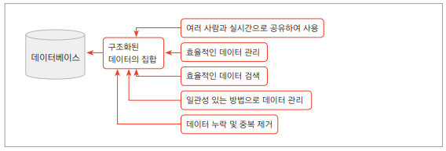
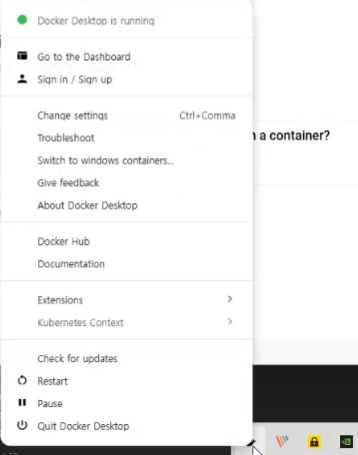

# java-database-2026
자바 개발자 과정 데이터베이스 리포지터리

## Day 01

### 데이터 / 정보

데이터는 컴퓨터환경의 단순한 값을 의미한다. 정보는 데이터에 정보에 의미를 부여한 것.


### 데이터베이스(DataBase : DB)
데이터를 기반으로 하는 관리 시스템을 의미한다. 데이터를 모아둔 장소를 의미하기도 한다.

- DataBase Management System 를 줄여서 DBMS라고 부름
- DBMS를 줄여서 DM라고도 함
- 대부분의 기업의 '도메인 정보' 를 저장하고 있다.




### 데이터베이스 종류
1. 관계형 RDBMS
    - `Oracle` = 학습할 DB
    - SQLServer - Microsoft사 제품. Oracle보다 성능이 낮음
    - MYSQL - Oracle로 합병
    - SQLServer - Microsoft사 제품. Oracle보다 성능이 낮음


### 오라클 설치 방법
1. 도커 설치 - DevOps의 필수품
    - https://www.docker.com
    - Download for Window - AMD64클릭 


2. 설치 후 실행
    - setting(오른쪽 상단 기어모양) 클릭
    - Start Docker Desktop when... 체크 후 Apply
      running잘 되는지 확인
    

### 도커에서 오라클 설치
1. Docker Desktop에서 검색 후 pull로 이미지 다운로드 가능  - 하지말것?

2. Docker Command 사용
    - powershel 오픈 후
    ```bash 
            docker --version 
            docker search oracle-xe #이거 하면 검색기능 나옴
            docker pull gvenzl/oracle-xe:21-slim #괜찮은거 확인 후 설치
    ```
3. 컨테이너 실행
    ```bash 
        docker run -d --name oracle-xe -p 1521:1521 -e ORACLE_PASSWORD=P12345s! gvenzl/oracle-xe:21-slim #관리자 계정
    ```

4. 컨테이너 내부 접속 (오라클)
    ``` bash
    docker exec -it oracle-xe sqlplus system/P12345s!@XE
    ```

5. 강의용 사용자 계정 생성
    ```sql
    CREATE USER java IDENTIFIED BY  java12345;  #이렇게 관리자 계정도 만들 수 있음

    GRANT CONNECT, RESOURCE TO java;

    GRANT CREATE TABLE TO java;

    grant all privileges to java;
    ```

### 데이터 베이스 개발툴 DBeaver설치

1. 개발툴 종류
    - sql*plus : 콘솔 개발 화면 매우 사용불편
    - Oracle SQL Developer : 오라클사가 제공하는 무료 툴
    - Toad for Oacle : DB개발툴 가장 강력한 상용라이선스
    - DBeaver : 오픈소스, 대중성이 높고 모든 DB를 다 사용
2. DBeaver 설치
    - https://dbeaver.io/
    - Community Edition 클릭

3. VScode 확장 
    - 


### DBeaver 사용법
    - DB Navigator에서 오른쪽클릭 > Create > Connection

    -연결 정보 입력 후 Test Connection
    - 주의사항 : Port번호 확인, Database이름변경 Oracle -> XE로 변경 ,Username , Password 일치


### 기본 사용법
-DBeaver
    - 연결된 XE - java > Schema(Database와 같은 의미)

- 샘플 데이터베이스 생성

    1. 테이블 생성 : [쿼리](./day01/table-1.sql)
    2. 시퀀스 생성 : [쿼리](./day01/sequence-2.sql)
    3. 부서데이터 생성 : [쿼리](./day01/department-3.sql)
    4. 직원데이터 생성 : [쿼리](./day01/employee-4.sql)
    5. 고객데이터 생성 : [쿼리](./day01/costom-5.sql)
    6. 상품데이터 생성 : [쿼리](./day01/product-6.sql)
    7. 주문데이터 생성 : [쿼리](./day01/order-7.sql)